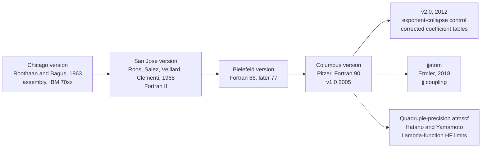

# `atmscf` (Columbus version): review of a basis-set-expansion Hartree–Fock program for atoms

*Prepared 21 September 2026.*

## Contents

0. Scope, evidence, and how to read this review
1. At a glance
2. Name, context, and lineage
3. Versions and revision history
4. Theory and algorithms
5. Implementation notes
6. Capability matrix
7. Typical workflows
8. Documented use and validation evidence
9. Critical assessment
10. Alternatives and complements
11. Recommendations
12. Publications related to the theory
13. Verification gaps and next steps

---

## 0. Scope, evidence, and how to read this review

**What this review is.** A structured assessment of the atomic self-consistent-field (SCF) program `atmscf`, Russell M. Pitzer's "Columbus version" of the Roothaan–Bagus expansion-method Hartree–Fock code, covering both published releases (v1.0, 2005; v2.0, 2012).

**Evidence base.** The full texts of the two Computer Physics Communications (CPC) papers are behind a paywall and I could not read them. What I did read:

- the abstracts and program summaries of both CPC records;
- the introduction and the section previews the publisher exposes for the 2005 paper (general theory, integrals, eigenproblem, SCF iterations, convergence control, exponent variation, output, input, limitations, acknowledgements, part of the reference list);
- excerpts from papers that use, modify, or cite the program (Ermler 2018; Hatano and Yamamoto 2020–2024; Cao, Dolg and Stoll 2003; Blaudeau et al. 2000; Roos-group papers).

I did **not** inspect the source code, run the program, or reproduce any numbers. This is therefore not a code audit.

**Confidence tags used throughout**

| Tag | Meaning |
|---|---|
| **[V]** | Verified in a source I retrieved (paper record, publisher preview, or citing paper). |
| **[B]** | Standard textbook-level background, included for completeness. Not verified against the program's papers. |
| **[A]** | My own analysis or judgement, built on the [V] facts cited beside it. |
| **[U]** | Unverified or uncertain. Treat as a lead, not a fact. |

Equations marked [B] or [A] are illustrative. Where the paper's exact formula was not retrievable, I say so.

Reference tags such as **[R8]** point to the bibliography in Section 12.

---

## 1. At a glance

| Item | Value | Tag |
|---|---|---|
| Program name | `atmscf` (also written ATMSCF or AT-MSCF; CPC catalogue ID `ADVR`) | [V] |
| Full title | *Atomic self-consistent-field program by the basis set expansion method: Columbus version* | [V] |
| Author | Russell M. Pitzer, Department of Chemistry, The Ohio State University | [V] |
| Physical model | Restricted Hartree–Fock for atoms, Roothaan–Bagus expansion method, LS (Russell–Saunders) coupling | [V] |
| Basis functions | Slater-type or Gaussian-type radial functions | [V] |
| Core treatment | All-electron, or valence-only with effective core potentials (ECPs) | [V] |
| Open shells | With some exceptions, at most one open shell per symmetry | [V] |
| Correlation | None (Hartree–Fock level) | [V] |
| Relativity | Only through relativistic ECPs | [V] |
| Language | Fortran 90 (dynamic memory allocation) | [V] |
| Footprint | About 10 MB RAM; typical run about 30 s | [V] |
| Main purpose | Developing Gaussian basis sets for molecular calculations | [V] |
| Distribution | CPC Program Library (Queen's University Belfast), `tar.gz`; v2.0 under the standard CPC licence | [V] |
| Releases | v1.0 (CPC 170, 2005); v2.0 (CPC 183, 2012, supersedes v1.0) | [V] |

**Bottom line [A].** `atmscf` is a compact, well-lineaged, purpose-built tool for one job: optimizing and characterizing atomic basis sets (especially Gaussian and ECP-based ones) at the Hartree–Fock level. It is not a general atomic-physics package. Its documented limits (LS coupling only, one open shell per symmetry, HF only, relativity only through ECPs) are the boundaries of that job. Its lineage is long and it has been extended by others (quadruple precision, a jj-coupling sibling), which is good evidence that the core algorithm is sound and portable.

---

## 2. Name, context, and lineage

### 2.1 Naming and search terms

- Literature uses `atmscf`, `ATMSCF`, and `AT-MSCF`. The CPC catalogue ID is `ADVR` (`ADVR_v1_0`, `ADVR_v2_0`). Search on all of them. [V]
- "Columbus" here most plausibly means Columbus, Ohio (the home of Pitzer's group at Ohio State). A later paper cites the code as "ATMSCF, R. M. Pitzer, The Ohio State University, Columbus, 1979". [V for the citation, A for the interpretation]
- It is **not** the COLUMBUS program system for multireference configuration interaction (MRCI), which was started in 1980 in the same university's chemistry department by Shavitt, Lischka and Shepard and is distributed under the LGPL. [V] The two are separate codes. A COLUMBUS system paper (2020) does cite `atmscf`, but I did not examine how the two are connected. [V for the citation, U for the connection]
- "Basis set expansion method" means Roothaan's algebraic approach: the radial orbitals are expanded in a finite set of analytic functions and the expansion coefficients are optimized. It contrasts with fully numerical atomic HF (finite difference, finite element, B-spline collocation). [B]

### 2.2 Lineage

| Stage | Contribution | Tag |
|---|---|---|
| Chicago (Roothaan and Bagus, 1963) | Original expansion-method atomic SCF program, written in assembly for IBM 70xx machines. The Columbus paper reuses its section numbers and titles so readers can compare. | [V] |
| San Jose (Roos et al., 1968) | Fortran II re-implementation, circulated as an IBM technical report. | [V] |
| Bielefeld | Fortran 66 (later modified to Fortran 77) descendant of the San Jose code. The Columbus version is based on it. | [V] |
| Columbus (Pitzer) | Fortran 90 rewrite: complete dynamic memory allocation, improved integral formulas, simplified programming, expanded energy-coefficient tables, ECP support. | [V] |
| jjatom (Ermler, 2018) | A recasting of the same classic SCF code into jj coupling with two-component spinors and relativistic ECPs. Described as essentially parallel to `atmscf`. | [V] |
| Hatano and Yamamoto | `atmscf` enhanced to quadruple precision and used as the SCF engine for very-high-precision HF limits with Laguerre-type ("Lambda") functions. | [V] |

Acknowledgements in the 2005 paper credit U.S. DOE (SciDAC), Bielefeld University, Ohio State University, the U.S. National Science Foundation, and Cray Research, with thanks to J.-P. Blaudeau and T. H. Dunning for discussions. [V]

---

## 3. Versions and revision history

| | v1.0 | v2.0 |
|---|---|---|
| Catalogue ID | `ADVR_v1_0` (`ADVR`) | `ADVR_v2_0` |
| Reference | Comput. Phys. Commun. **170**, 239–264 (2005), doi:10.1016/j.cpc.2005.04.003 | Comput. Phys. Commun. **183**, 1841–1842 (2012), doi:10.1016/j.cpc.2012.02.009 |
| Online date | 1 July 2005 (issue dated 15 August 2005) | 28 February 2012 (issue dated August 2012) |
| Distributed lines (incl. test data) | 2113 | 4771 |
| Distributed bytes | 15,379 | 24,154 |
| Target platforms | Sun, SGI, PC; Solaris, Irix, Linux | PC, or any machine with a Fortran 90 compiler; any OS with an f90 compiler |
| RAM | 10 MB | 10 MB |
| Typical run time | 30 s per calculation | 30 s per calculation |
| Licence | Not shown in the summary I saw | Standard CPC licence |
| Classification | PACS 31.15.Ar, 31.15.Ne | CPC classification 2.1, 2.7 |

All entries above are [V].

**What v2.0 changed [V]**

1. **Exponent-collapse control.** The logarithms of a set of orbital exponents are expanded in a series of Legendre functions. Selected coefficients can be constrained to zero, which constrains how the exponents may move. Keeping only the first two coefficients non-zero yields an even-tempered basis. The purpose is to stop two adjacent exponents from collapsing onto each other during optimization.
2. **Two open-shell energy coefficients corrected.** The summary lists the coefficient $K_{314}$ for the $f^1(^2F)\,p^1(^2P)$ configuration as $10/21$ for the $^3G$ state and $2/3$ for the $^1G$ state. The previous values are not given in the summary.
3. **More half-filled-shell states.** For $d^5$ and $f^7$, where more than one wave function can arise for a given $S$, $L$ and some have no Hamiltonian matrix element connecting them to others, energy expressions were added. A seniority label as a left subscript distinguishes them (for example ${}^{2}_{5}G$ and ${}^{2}_{3}G$ of $d^5$). The added functions are not necessarily the lowest of their sets.
4. **More Fortran 90 features** used.
5. **Updated full paper** published as supplementary material (a revised form of the 2005 paper covering points 1–3). Suggestion [A]: cite both CPC papers and use the supplementary PDF as the current manual.

**Why point 1 matters [A].** Blaudeau et al. (2000) report that exponent optimization for larger atoms frequently ends with adjacent exponents coalescing, and that actinides are the hardest case. [V] Version 2.0's constrained parametrization is a direct answer to that documented failure mode.

---

## 4. Theory and algorithms

### 4.1 Wave function and expansion

The orbitals are single-determinant, spherically organized by angular-momentum symmetry $\lambda$ with component $\alpha$ (commonly $m_\ell$), and each is a linear combination of basis functions: [V]

$$
\phi_{i\lambda\alpha}=\sum_{p}\chi_{p\lambda\alpha}\,C_{pi\lambda}
$$

Orthonormality of the orbitals is the usual $\int \phi_{i\lambda\alpha}^{\ast}\,\phi_{j\lambda\alpha}\,d\tau=\delta_{ij}$, which in the basis becomes $\mathbf{c}_i^{T}\mathbf{S}\,\mathbf{c}_j=\delta_{ij}$. [B]

The basis functions are products of a radial and an angular part. In the standard forms, [B]

$$
\chi_{p\lambda\alpha}(\mathbf r)=N_{p\lambda}\,r^{\,n_{\lambda p}-1}\,e^{-\zeta_{\lambda p}\,r}\,Y_{\lambda\alpha}(\theta,\varphi)\quad\text{(Slater)},
$$

$$
\chi_{p\lambda\alpha}(\mathbf r)=N_{p\lambda}\,r^{\,n_{\lambda p}-1}\,e^{-\zeta_{\lambda p}\,r^{2}}\,Y_{\lambda\alpha}(\theta,\varphi)\quad\text{(Gaussian)},
$$

with $n_{\lambda p}=\lambda+1$ typical for Gaussians. The paper's exact normalization conventions were not retrievable. [U]

### 4.2 Energy expression and LS coupling

For an LS term of a configuration with shells $s,t$ of occupation $q_s$, the total energy has the Slater–Condon form: [B]

$$
E=\sum_{s}q_s\,I_s+\sum_{s\le t}\Big[\sum_{k}a^{k}_{st}\,F^{k}(s,t)+\sum_{k}b^{k}_{st}\,G^{k}(s,t)\Big]
$$

Here $I_s$ is the one-electron integral (kinetic energy plus nuclear attraction, or the ECP in valence-only work), $F^{k}$ and $G^{k}$ are direct and exchange radial (Slater) integrals, and $a^{k}_{st}$, $b^{k}_{st}$ are term-dependent coefficients. This is my schematic notation, not the paper's.

What is specific to the program [V]: the paper tabulates the needed **energy-expression coefficients** for the ground states of all atoms, to the extent LS coupling applies, plus excited states that involve large-$\ell$ orbitals. Version 2.0 corrected two entries and added half-filled-shell states (Section 3). With a few exceptions, only one open shell per symmetry is allowed.

### 4.3 The Roothaan eigenproblem

For each symmetry the program solves [V]

$$
\mathbf{F}\,\mathbf{c}=\varepsilon\,\mathbf{S}\,\mathbf{c}
$$

Roothaan and Bagus computed eigenvalues and eigenvectors **one at a time in the presence of the overlap matrix** rather than first transforming $\mathbf S$ to a unit matrix and diagonalizing. They argued for this on stability, accuracy and simplicity grounds. The Columbus paper notes that some of those constraints are less limiting with today's hardware. [V]

Implication [A]: this choice is part of why the code tolerates non-orthogonal, strongly overlapping Gaussian sets, and it is also where modernizing (for example a canonical-orthogonalization option with linear-dependence thresholds) would be a natural extension.

### 4.4 Integral evaluation

One-electron integrals (except core-potential integrals) come from the Roothaan–Bagus and Roos et al. formulas plus one further cited source, and the two-electron integrals from another cited source, with some notation changes. The paper says it summarizes all formulas in one place and describes the formulas as improved relative to earlier versions. [V]

Expressions shared by the Slater and Gaussian cases [V]:

$$
V_n(x)=\frac{n!}{x^{\,n+1}},\qquad W_n(x)=\frac{n-1}{x}
$$

$$
n_{\lambda pq}=n_{\lambda p}+n_{\lambda q},\qquad \zeta_{\lambda pq}=\zeta_{\lambda p}+\zeta_{\lambda q}
$$

$$
E^{n}_{k}(x)=\frac{\sum_{j=0}^{k-1}\binom{n}{j}x^{j}}{\binom{n}{k}\,x^{k}}
$$

I checked algebraically [B] that this definition satisfies the recursion

$$
E^{n}_{k}(x)=\frac{k\,\big[\,1+E^{n}_{k-1}(x)\,\big]}{(n-k+1)\,x},\qquad E^{n}_{0}(x)=0,
$$

which matches the fragment of the recursion visible in the preview.

### 4.5 SCF iterations, extrapolation, and convergence control

- **Extrapolation [V].** Roothaan and Bagus described two extrapolation methods that use each orbital coefficient from three successive SCF iterations. The Fortran versions have used only the first, as implemented by Roos et al. The exact formula was cut off in the preview.
- **Illustration only [B, U].** A generic three-point (Aitken $\Delta^2$) extrapolation of a coefficient looks like

$$
C^{\mathrm{extrap}}=C_k-\frac{(C_k-C_{k-1})^{2}}{C_k-2\,C_{k-1}+C_{k-2}}
$$

  and is shown only to convey the idea of three-iterate extrapolation. It is not claimed to be the program's formula.
- **Convergence control [V].** Both diagonalization and SCF iterations are judged by the largest absolute difference in orbital coefficients between successive iterations. The input sets the minimum acceptable accuracy, and the program tries for better accuracy where it can and uses it. Some control options of the original design were omitted in the Columbus version.

### 4.6 Exponent optimization

Documented mechanics [V]:

- A specified number, `NVAR`, of orbital exponents is varied, either individually (`ISCALE=0`) or together as a group (`ISCALE=1`).
- Step sizes are `ZSCALE` times the initial exponent values.
- Energies are computed until three adjacent values have the middle one lowest, then a parabolic fit estimates the minimum.
- `NZET` sets the number of independent exponent values, so selected exponents can be constrained equal.

For equally spaced trial exponents $\zeta_2-h,\ \zeta_2,\ \zeta_2+h$ with energies $E_1,E_2,E_3$ and $E_2$ lowest, the parabolic vertex is [B]

$$
\zeta_{\min}=\zeta_2+\frac{h\,(E_1-E_3)}{2\,(E_1-2E_2+E_3)}
$$

Reading "intervals set at `ZSCALE` times the initial exponent" as $h=\mathrm{ZSCALE}\cdot\zeta^{(0)}$ is my interpretation. [A]

**Version 2.0 Legendre parametrization [V concept, A notation].** For $K$ exponents in one symmetry, map the index to $x_k=-1+2(k-1)/(K-1)$ and write

$$
\ln\zeta_k=\sum_{m=0}^{M}c_m\,P_m(x_k)
$$

Constraining $c_m=0$ for $m\ge 2$ gives $\ln\zeta_k=c_0+c_1x_k$, that is

$$
\zeta_k=\alpha\,\beta^{\,k-1},\qquad \alpha=e^{\,c_0-c_1},\quad \beta=e^{\,2c_1/(K-1)}
$$

an even-tempered set, as the release notes state. The even-tempered limit holds for any affine index mapping, so it does not depend on my choice of $x_k$.

### 4.7 Effective core potentials

- The program can run valence-only with ECPs, and relativistic effects enter only "to the extent possible with relativistic ECPs". [V]
- Core-potential integrals are handled separately from the other one-electron formulas. [V]
- The sibling code jjatom expresses the radial ECP in a Gaussian expansion, $w_{lj}(r)=r^{2}\big[U^{\mathrm{RECP}}_{lj}(r)-Z^{\mathrm{core}}/r\big]=\sum_i d_i\,r^{\,n_i-2}e^{-\zeta_i r^{2}}$. [V for jjatom] Whether `atmscf` uses the same representation is plausible but not verified. [U]
- ECP basis sets describe pseudo-orbitals, not orbitals. The functions must serve the valence region while keeping the pseudo-orbital small in the core region, which is hard for 1s primitives because their maxima sit at the nucleus. Natural-orbital contractions gave the best results in the study of Blaudeau et al. [V]

---

## 5. Implementation notes

**Documented [V]**

- Fortran 90, all floating-point quantities declared `REAL*8` (double precision). On 64-bit-word machines such as Cray, the compiler option that turns off double precision should be used.
- Arrays are allocated dynamically.
- Most run time goes to integral evaluation and to multiplying "supermatrices" by "supervectors". That code is arranged so moderate vectorization is possible.
- Simplicity of programming was an explicit design goal.
- Output options are limited to printing the integrals over basis functions (`NPRINT`) and writing optimized exponents and coefficients (`IPNCH`).
- Input is free-format and follows the convention set by the Roos et al. code, with directions in Appendix B of the paper.
- Distributed as a `tar.gz` with test data; v2.0 is 4771 lines including test data.

**Observations for adopters and maintainers [A]**

- Hard-coded `REAL*8` is the obstacle to higher precision. Hatano and Yamamoto had to modify the code to reach quadruple precision. A `selected_real_kind` parameter module would make this a compile-time switch.
- With time dominated by integrals and dense matrix-vector products, the obvious parallelization targets are the integral loops (for example OpenMP) and BLAS-backed products. No parallelism is documented.
- The interface is minimal by modern standards (fixed input variables, small output set). Wrapping it in a scripting layer that generates inputs and parses the punched exponents is the practical route to automation.

---

## 6. Capability matrix

| Capability | Status | Tag |
|---|---|---|
| Slater-type basis | Supported | [V] |
| Gaussian-type basis | Supported | [V] |
| All-electron atoms | Supported | [V] |
| Valence-only with (relativistic) ECPs | Supported | [V] |
| Ground states of all atoms (LS coupling) | Supported via energy-coefficient tables | [V] |
| Excited states | Limited to those with large-$\ell$ orbitals, plus added $d^5$, $f^7$ states in v2.0 | [V] |
| Multiple open shells | Limited: one per symmetry, with some exceptions (the exceptions are not specified in what I read) | [V] |
| Exponent optimization (individual or group) | Supported | [V] |
| Constrained or even-tempered exponents | Supported in v2.0 | [V] |
| Electron correlation | Not supported (HF only) | [V] |
| Fully relativistic (Dirac–Fock, Breit, QED) | Not supported. The jjatom paper positions `atmscf` and jjatom as not for general-purpose atomic physics, unlike GRASP2K and FAC | [V] |
| jj coupling | Not in `atmscf`; provided by the sibling jjatom | [V] |
| Quadruple precision | Not native; achieved by modifying the code | [V] |
| Parallel execution | None documented | [V/U] |
| Restart and initial guess | Large bases needed an initial vector close to the solution (Hatano and Yamamoto); other guess options unknown | [V/U] |
| State averaging | Not documented in what I read; a later paper on state-averaged MCSCF cites the program | [U] |

---

## 7. Typical workflows

These are described in general terms. Where a step is my suggestion rather than something a source documents, it is marked [A].

1. **Optimize a primitive Gaussian set for an atom (main use).** Choose the number of primitives per symmetry, start from existing or even-tempered exponents, and let the program optimize the total energy with respect to the exponents (`NVAR`, `ISCALE`, `ZSCALE`, `NZET`). Use v2.0's Legendre constraints if exponents start to collapse. [V for the mechanics, A for the ordering]
2. **Build contracted or ANO-type sets.** Generate the atomic solution, then contract. Blaudeau et al. found natural orbitals gave the best contraction results and followed Dunning's correlation-consistent procedure for the number and optimization of primitives. [V]
3. **ECP pseudo-orbital sets.** Run valence-only with the ECP and optimize primitives to describe pseudo-orbitals. Actinides are the hardest case because basis sets must serve valence shells of different radial size at once. [V]
4. **High-precision HF-limit benchmarks.** Use the program as the SCF engine with externally computed integrals over Laguerre-type functions, in quadruple precision. Bootstrap large expansions from a smaller converged solution. [V]
5. **Sanity checks before trusting a basis [A].** Confirm the finite-basis HF energy lies above known HF limits and decreases monotonically as the basis grows (variational principle [B]); check the virial ratio; check the exponent spacing for near-coalescence; check conditioning of $\mathbf S$. One study reports satisfying the virial relation to about $10^{-14}$–$10^{-17}$ with second-order exponent optimization in Roothaan–Bagus-type Slater calculations for open p-shell atoms (doi:10.1007/s10812-012-9557-7). [V]

---

## 8. Documented use and validation evidence

| Work | Ref | How `atmscf` appears | Confidence |
|---|---|---|---|
| Pitzer 2005 paper | R1 | States basis-set development for molecular calculations as its principal use and cites three basis-set studies as examples (numbering inferred from list order) | [V] |
| Blaudeau et al. 2000 (Pitzer is a co-author) | R23 | ECP basis-set development; documents exponent coalescence and actinide difficulty | [V] for content, [U] whether the paper names the code |
| Cao, Dolg, Stoll 2003 | R24 | Reference list cites "Atomic electronic structure code ATMSCF, R. M. Pitzer, The Ohio State University, Columbus, 1979" | [V] |
| Hatano and Yamamoto, 2020–2024 | R25–R29 | Modified `atmscf` used as SCF engine; details below | [V] |
| Ermler 2018 (jjatom) | R19 | Sibling code derived from the same lineage | [V] |
| Shepard and Brozell 2019; Jiao et al. 2019; Seth and Ziegler 2012; Mrozik and Pitzer 2011; Hauser et al. 2008; Sioutis et al. 2007; Lischka et al. 2020 | R31–R37 | Listed by the publisher as citing the 2005 or 2012 paper | [V] for the citation, [U] for the context |
| J. Math. Chem. 2026 Lambda-function HF paper | R30 | Cites the 2012 paper in its reference list | [V] |
| An unidentified paper | n/a | A snippet says an even-tempered d-function coefficient was compared with a single-exponent optimization "with the Columbus version of the AT-MSCF program"; the source paper was not identified | [U] |

**What Hatano and Yamamoto's use shows [V]**

- They used two SCF programs: ATOMCI for small expansions and `atmscf` for large ones. Neither has integral generation for Laguerre-type functions, so they interfaced their own integral program to the SCF modules.
- `atmscf` needed an initial vector quite close to the final solution, so they obtained a solution with ATOMCI first and transferred it.
- They raised the original double-precision program to quadruple precision, with the Fock-matrix diagonalization threshold at $10^{-30}$ and the SCF convergence criterion (relative energy difference) at $10^{-21}$.
- Reported results include the He HF energy $-2.86167999561223887877554374002$ Eh and, for Zn, $-1777.8481161913610697783$ Eh, agreeing to 22 digits with an independent numerical value. They also confirmed that Zn's 1s orbital has a genuine node (at $r=0.5588720457$ a.u.) and traced it to exchange interactions.
- Their integral program (AIHFLTF, R28) converts multiprecision integrals to quadruple precision before passing them to `atmscf`.

**What this evidence does and does not show [A].** It shows the SCF core is numerically well behaved enough to sit behind 22–30-digit benchmarks once precision is raised, which is strong evidence for the algorithm. It says nothing about how the stock double-precision program behaves on hard cases (large near-dependent bases, poor starting guesses), beyond the initial-vector remark.

---

## 9. Critical assessment

### 9.1 Strengths

1. **Deep lineage.** About six decades of continuous descent from the Roothaan–Bagus original, with each stage documented. The 2005 paper deliberately preserves the original section structure for traceability. [V]
2. **Coverage of open-shell energy expressions.** Tabulated coefficients for the ground state of every atom in LS coupling, plus targeted excited states, removes the burden of deriving term energies by hand. Version 2.0 fixed errors and extended the tables. [V]
3. **Built-in exponent optimization** with a documented fix for exponent collapse and a clean even-tempered special case. This is the feature that most directly serves the main use case. [V]
4. **ECP-ready.** Valence-only pseudo-orbital work is supported, which matters for basis sets used with relativistic ECPs. [V]
5. **Small and portable.** About 10 MB of memory, about 30 s per run, plain Fortran 90 that any f90 compiler accepts in v2.0. [V]
6. **Demonstrated extensibility.** Quadruple precision (Hatano and Yamamoto) and the jjatom sibling show the design tolerates serious extension. [V]

### 9.2 Weaknesses and risks

1. **Scope limits.** LS coupling only, HF only, at most one open shell per symmetry (with unspecified exceptions), relativity only via ECPs. Users who need multiplet-resolved, jj-coupled, or correlated atomic results must go elsewhere. [V]
2. **Starting-guess sensitivity at large basis size.** Hatano and Yamamoto needed to seed the program from another code's solution. Robustness in large or near-linearly-dependent bases is therefore a practical risk. [V for the report, A for the generalization]
3. **Convergence machinery is dated.** The documented accelerator is coefficient extrapolation from three iterates. I found no mention of DIIS or second-order methods in the accessible text, but absence from a preview is not proof of absence. [A/U]
4. **Hard-wired double precision.** Higher precision needs source edits. [V]
5. **Thin I/O and automation story.** Few output options, legacy-style input, and no documented scripting interface. [V]
6. **Documentation is essentially one paper** (plus its 2012 supplement), and the full text sits behind a paywall. [V]
7. **Licensing and hosting need checking.** v2.0 is under the standard CPC licence, which is not a general open-source licence; read its terms before commercial or redistributive use. The v1.0 summary I saw did not show licence terms, and I did not verify that the CPC Library URLs quoted in the papers are still live. [A/U]
8. **Small citation footprint.** Publisher pages listed only 7 citing papers for the 2005 record and 8 for the 2012 record at the time I looked. Community knowledge and third-party tests are correspondingly limited. [V for counts, A for the inference]

### 9.3 Fit summary [A]

| Need | Verdict |
|---|---|
| Optimize Gaussian or Slater exponents for an atom at the HF level | Good fit |
| Pseudo-orbital basis sets for ECPs | Good fit (documented use) |
| Reference HF energies to 20+ digits | Possible only with precision modifications and external integrals |
| Multiplet structure, jj coupling | Use jjatom or a dedicated atomic-structure code |
| Fully relativistic atomic structure | Use GRASP2K or FAC |
| Correlated atomic energies | Out of scope; use a molecular or atomic correlated code with `atmscf`-derived basis sets |

---

## 10. Alternatives and complements

| Code or approach | Reference | Characteristics (as retrieved) | Tag |
|---|---|---|---|
| `atmscf` | R1, R2 | Expansion-method RHF, LS coupling, STO/GTO, ECPs, exponent optimization | [V] |
| jjatom | R19 | jj coupling, two-component atomic spinors, relativistic ECPs; supplies ECPs and GTO basis sets for Z=3–118; Fortran 90; GPLv3 | [V] |
| GRASP2K, FAC | cited in R19 | Rigorous all-electron, fully relativistic formalisms; general-purpose atomic physics | [V] |
| ATOMCI | cited in R25 | SCF code with Gaussian/Slater integral modules; used for small expansions in that work; other capabilities not examined | [V/U] |
| x2dhf | R41 | Finite-difference HF and DFT for atoms and diatomics; Fortran 95 with C; OpenMP and pthreads; Libxc; CMake build; GPLv3 | [V] |
| B-spline HFR | R38 | HF–Roothaan energies and expectation values for neutral atoms He to Uuo via B-spline expansion | [V] |
| Fully numerical atomic HF/DFT | R39, R40 | Reference-quality numerical results and a review of the field | [V] |
| Lambda-function (Laguerre-type) expansions | R25–R30 | Complete orthonormal bound-state basis; no linear dependence; monotone convergence to the HF limit; `atmscf` used as the SCF engine | [V] |

For validating an `atmscf`-derived basis, the fully numerical results (R38–R41) are the natural reference values, since a finite-basis HF energy must lie above the HF limit. [A]

---

## 11. Recommendations

**For users [A]**

1. Cite both R1 and R2, and use v2.0 with the supplementary paper as the manual.
2. Run the bundled test cases first and confirm you reproduce them before any production work.
3. For difficult atoms (heavy, near-degenerate shells), use v2.0's constrained exponent parametrization rather than free optimization.
4. For large expansions, bootstrap from a smaller converged solution (the approach Hatano and Yamamoto had to use).
5. Check virial ratio, monotone energy decrease with basis size, exponent spacing, and the conditioning of $\mathbf S$ before accepting a basis.
6. Choose the tool to the task: jjatom for jj coupling, GRASP2K or FAC for fully relativistic work, correlated molecular codes for correlation.

**For maintainers and porters [A]**

1. Parametrize the floating-point kind with `selected_real_kind` so quadruple precision is a build option.
2. Add optional DIIS or second-order convergence acceleration behind a flag, and keep the documented extrapolation as the default so results stay comparable.
3. Introduce a regression suite: He, a p-shell atom, a transition-metal $d^n s^m$ atom, one ECP case, plus the He and Zn high-precision values above as convergence targets for precision builds.
4. Parallelize the integral loops and back the dense products with BLAS.
5. Provide a machine-readable input and output layer (for example namelists or JSON) and a scripting wrapper for exponent-optimization campaigns.

---

## 12. Publications related to the theory

Tags: **[V]** bibliographic details seen in a retrieved record; **[V-partial]** some details not captured; **[U]** identification not confirmed. Entries marked *(context)* are background or comparison literature that I did not confirm the program's papers cite.

### A. The program itself

- **R1.** R. M. Pitzer, "Atomic self-consistent-field program by the basis set expansion method: Columbus version," *Comput. Phys. Commun.* **170**, 239–264 (2005). doi:10.1016/j.cpc.2005.04.003. [V]
- **R2.** R. M. Pitzer, "Atomic self-consistent-field program by the basis set expansion method: Columbus version" (new version announcement, catalogue ID ADVR_v2_0), *Comput. Phys. Commun.* **183**, 1841–1842 (2012). doi:10.1016/j.cpc.2012.02.009. Supplementary material: updated version of the 2005 full paper. [V]
- **R3.** R. M. Pitzer, QCPE (1990). Listed in the 2005 reference list; the paper attributes its Bielefeld predecessor to a numbered reference that I infer is this item. Title and program number not captured. [V-partial, U]
- **R4.** R. M. Pitzer, atomic electronic structure code ATMSCF, The Ohio State University, Columbus (1979), as cited in R24. [V-partial]

### B. Core theory and algorithmic ancestry

- **R5.** C. C. J. Roothaan, "New Developments in Molecular Orbital Theory," *Rev. Mod. Phys.* **23**, 69–89 (1951). [V]
- **R6.** G. G. Hall, "The Molecular Orbital Theory of Chemical Valency. VIII. A Method of Calculating Ionization Potentials," *Proc. R. Soc. A* **205**, 541–552 (1951). [V]
- **R7.** C. C. J. Roothaan, "Self-Consistent Field Theory for Open Shells of Electronic Systems," *Rev. Mod. Phys.* **32**, 179–185 (1960). [V]
- **R8.** C. C. J. Roothaan and P. S. Bagus, "Atomic self-consistent field calculations by the expansion method," in *Methods in Computational Physics*, Vol. 2, Academic Press, New York (1963), pp. 47–94. [V]
- **R9.** I. Shavitt, "The Gaussian function in calculations of statistical mechanics and quantum mechanics," in *Methods in Computational Physics*, Vol. 2 (1963), starting p. 1. Same volume as R8, on Gaussian integrals; whether the program's papers cite it is not confirmed. [V-partial] *(context)*
- **R10.** B. Roos, C. Salez, A. Veillard, and E. Clementi, "A general program for calculation of atomic SCF orbitals by the expansion method," IBM Research Report RJ518, San Jose, California (1968). [V]
- **R11.** G. L. Malli and J. P. Olive, LMSS Technical Report 1962-3, Part 2, University of Chicago. Appears in the 2005 reference list; its role was not identified. [V-partial, U]
- **R12.** E. Clementi, "Atomic energy tables," supplement to *IBM J. Res. Develop.* **9**, 1 (1965), as cited in R20 and R21. [V-partial] *(context)*
- **R13.** P.-O. Löwdin, "On the Nonorthogonality Problem," *Adv. Quantum Chem.* **5**, 185–199 (1970). [V] *(context: handling of the overlap matrix)*
- **R14.** S. Krebs, "A review on the derivation of the spin-restricted Hartree–Fock (RHF) self-consistent field (SCF) equations for open-shell systems. Description of different methods to handle the off-diagonal Lagrangian multipliers coupling closed and open shells," *Comput. Phys. Commun.* **116**, 137–277 (1999). [V] *(context)*
- **R15.** J. A. Pople and R. K. Nesbet, "Self-Consistent Orbitals for Radicals," *J. Chem. Phys.* **22**, 571 (1954). [V] *(context: unrestricted contrast)*
- **R16.** G. Berthier, "Configurations électroniques incomplètes. Partie I. La méthode du champ moléculaire self-consistent et l'étude des états à couches incomplètes," *J. Chim. Phys.* **51**, 363–371 (1954). [V] *(context)*
- **R17.** S. Lehtola, "An overview of self-consistent field calculations within finite basis sets," arXiv:1912.12029. [V-partial] *(context)*

### C. Effective core potentials and relativistic context

- **R18.** Y. S. Lee, W. C. Ermler, and K. S. Pitzer, "Ab initio effective core potentials including relativistic effects. I. Formalism and applications to the Xe and Au atoms," *J. Chem. Phys.* **67**, 5861–5876 (1977). [V]
- **R19.** W. C. Ermler, "jj-Coupling-based atomic self-consistent-field calculations with relativistic effective core potentials and two-component spinors," *Comput. Phys. Commun.* **229**, 182–198 (2018). doi:10.1016/j.cpc.2018.03.017. Program files doi:10.17632/zs4twp8r67.1. [V]

### D. Basis-set development in this lineage

- **R20.** A. Veillard, "Gaussian basis set for molecular wavefunctions containing second-row atoms," *Theoret. Chim. Acta* **12**, 405–411 (1968). doi:10.1007/BF00525918. [V]
- **R21.** B. Roos and P. Siegbahn, "Gaussian basis sets for the first and second row atoms," *Theoret. Chim. Acta* **17**, 209–215 (1970). doi:10.1007/BF00527179. [V]
- **R22.** B. Roos, A. Veillard, and G. Vinot, "Gaussian basis sets for molecular wavefunctions containing third-row atoms," *Theoret. Chim. Acta* **20**, 1–11 (1971). doi:10.1007/BF00529105. Identified by match with the "B. Roos et al., Theor. Chim. Acta (1971)" entry in R1's list. [V, U for the match]
- **R23.** J.-P. Blaudeau, S. R. Brozell, S. Matsika, Z. Zhang, and R. M. Pitzer, "Atomic orbital basis sets for use with effective core potentials," *Int. J. Quantum Chem.* **77**, 516–520 (2000). doi:10.1002/(SICI)1097-461X(2000)77:2<516::AID-QUA2>3.0.CO;2-U. [V]
- **R24.** X. Cao, M. Dolg, and H. Stoll, "Valence basis sets for relativistic energy-consistent small-core actinide pseudopotentials," *J. Chem. Phys.* **118**, 487–496 (2003). doi:10.1063/1.1521431. [V]
- **R24a.** X. Cao and M. Dolg, "Valence basis sets for relativistic energy-consistent small-core lanthanide pseudopotentials," *J. Chem. Phys.* **115**, 7348–7355 (2001). doi:10.1063/1.1406535. Related work; use of `atmscf` not verified. [V, U] *(context)*

### E. High-precision HF limits with Lambda functions (modified `atmscf` as SCF engine)

- **R25.** Y. Hatano and S. Yamamoto, "Atomic Hartree–Fock limit calculations using Lambda functions," *J. Phys. Commun.* **4**, 085006 (2020). doi:10.1088/2399-6528/aba995. [V]
- **R26.** Y. Hatano, …, S. Yamamoto, "Nodes in Hartree–Fock 1s atomic orbitals caused by exchange interactions," *Comput. Theor. Chem.* **1204**, 113400 (2021). [V]
- **R27.** Y. Hatano and S. Yamamoto, "Performance of Lambda functions in atomic Hartree–Fock calculations," *Mol. Phys.* **120**, e2027534 (2022). [V]
- **R28.** Y. Hatano and S. Yamamoto, "AIHFLTF: Integrals in Laguerre function bases for electronic structure calculations in atoms," *Comput. Phys. Commun.* **284**, 108623 (2023). Fortran 95, MIT licence; program files doi:10.17632/t4nxzbyssc.1. [V]
- **R29.** Y. Hatano, …, H. Tatewaki, "Accuracy of expectation values of one-electron operators obtained from Hartree–Fock wavefunctions expanded using Lambda functions," *Int. J. Quantum Chem.* **124**, e27246 (2024). [V]
- **R30.** "Highly accurate atomic Hartree–Fock calculations by algebraic evaluation of two-electron integrals over Lambda functions," *J. Math. Chem.* (2026). doi:10.1007/s10910-026-01805-5. Authors not captured; cites R2. [V-partial]

### F. Extensions and works that cite the program

- **R31.** R. Shepard and S. R. Brozell, "The all configuration mean energy multiconfiguration self-consistent-field method. I. Equal configuration weights," *Mol. Phys.* **117** (2019). [V]
- **R32.** L. G. Jiao, …, Y. K. Ho, "Accurate computation of screened Coulomb potential integrals in numerical Hartree–Fock programs," *Comput. Phys. Commun.* **244** (2019). [V]
- **R33.** M. Seth and T. Ziegler, "Range-separated exchange functionals with Slater-type functions," *J. Chem. Theory Comput.* **8** (2012). [V]
- **R34.** M. K. Mrozik and R. M. Pitzer, "Effect of electron correlation on the Pa atom energy levels and electron coupling," *Theor. Chem. Acc.* **129** (2011). [V]
- **R35.** A. W. Hauser, …, W. E. Ernst, "On the doublet states of the potassium trimer," *J. Chem. Phys.* **129**, 044307 (2008). [V]
- **R36.** I. Sioutis, …, T. A. Miller, "Jahn–Teller and related effects in the silver trimer. I. The ab initio calculation of spectroscopically observable parameters for the $\tilde X\,{}^2E'$ and $\tilde A\,{}^2E''$ electronic states," *J. Chem. Phys.* **126**, 124308 (2007). [V]
- **R37.** H. Lischka, …, Z. Zhang, "The generality of the GUGA MRCI approach in COLUMBUS for treating complex quantum chemistry," *J. Chem. Phys.* **152**, 134110 (2020). [V]

### G. Complementary numerical atomic-structure literature (for validation and comparison)

- **R38.** S. L. Saito, "Hartree–Fock–Roothaan energies and expectation values for the neutral atoms He to Uuo: The B-spline expansion method," *At. Data Nucl. Data Tables* **95**, 836–870 (2009). doi:10.1016/j.adt.2009.06.001. [V] *(context)*
- **R39.** S. Lehtola, "Fully numerical Hartree–Fock and density functional calculations. I. Atoms," *Int. J. Quantum Chem.* **119**, e25945 (2019). arXiv:1810.11651. [V] *(context)*
- **R40.** S. Lehtola, "A review on non-relativistic, fully numerical electronic structure calculations on atoms and diatomic molecules," *Int. J. Quantum Chem.* **119**, e25968 (2019). arXiv:1902.01431. [V] *(context)*
- **R41.** "Review of the finite difference Hartree–Fock method for atoms and diatomic molecules, and its implementation in the x2dhf program," arXiv:2408.03679. Authors not captured. [V-partial] *(context)*

---

## 13. Verification gaps and next steps

**Not verified in this review**

1. Full text of R1 and R2 and the supplementary updated paper: the energy-coefficient tables, the exact extrapolation formulas, the ECP integral treatment, initial-guess options, and the input specification (Appendix B).
2. The source code: every algorithmic statement here comes from papers and excerpts, not from reading the Fortran.
3. Any run, benchmark, or timing. The 30 s figure is the authors' typical value.
4. Licence terms for v1.0, and whether the CPC Library URLs in the papers are still live or the code has moved.
5. The context in which each citing paper in R31–R37 uses `atmscf`.
6. Identity of R3 (QCPE 1990) and R11, and the "exceptions" to the one-open-shell-per-symmetry rule.
7. Whether state-averaged or multiplet-averaged energy expressions are available in the released versions.

**Suggested next steps [A]**

1. Download the supplementary PDF attached to the 2012 CPC record (the updated full paper); it is the most current documentation.
2. Obtain the `tar.gz` from the CPC Library, compile with a recent Fortran compiler, and run the bundled tests.
3. Read the code against the paper's section structure, starting with the integral routines and the exponent-variation logic.
4. Reproduce a small benchmark (for example He and a p-shell atom) and check virial ratio and variational behaviour before attempting anything heavier.
5. Resolve the open bibliographic items (R3, R11) from the 2005 reference list.

---

> [!NOTE]
> 
> Generated by Claude.ai
>
> Model: Sonet 5
>
> Prompt: Create an exhaustive review of the atmscf (Columbus version) Basis-set-expansion Hartree-Fock program for atoms. Also provide a list of publications related to the package's theory. Show the output in Markdown format. Do not copy the output of the exported files into the chat.
